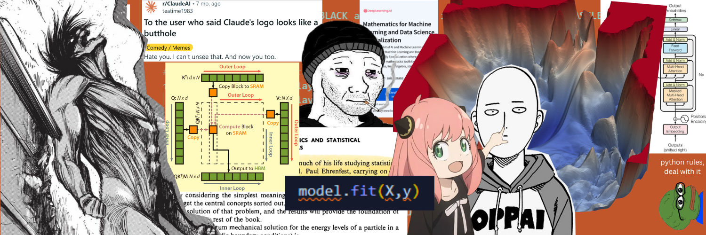

# LLM Mechanics (implementing from scratch)

This repository is my personal playground to implement large language models (LLM) and their building blocks from scratch using PyTorch. If you like to know the theory behind how LLMs operate, check out my [Advanced ML Learning Journal](https://github.com/hesamsheikh/ml-retreat).

  

